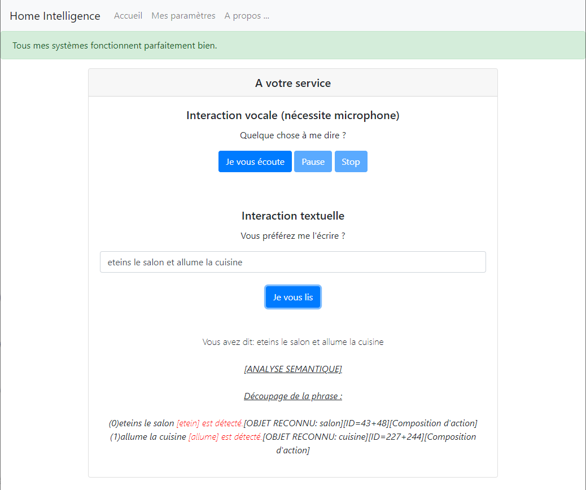

# Home-Intelligence
Software that gives your home a brain.

**This project is no longer in development, I am working on a newer version using neural networks.**

## What is it ?
**Home-intelligence** is meant to help you while your are (or not) at your home. 
When installed on any computer (must be linux), and connected to your house API (like Jeedom) you will be able to control everything from your voice and/or via text messages. 
You can give order as well as just having conversation with your house, it has a lot to say :).
With a customizable hotword, everything is possible.

## How to install
First install apache web server, then just put all this repository inside the html folder and you're goo. 
Don't forget to run the installation.sh script inside the script folder.  
You can edit home-intelligence's knowledge by editing the api/userDB.php file.

## Example:

## Future goals
I'm developing new features such as classification and regression algorithms to automatically detect when turning on lights, tv, ...  
For now only french is supported but it is easy to switch language for the speech recognition, just switch model-fr folder content with an english version from the vosk repository.
